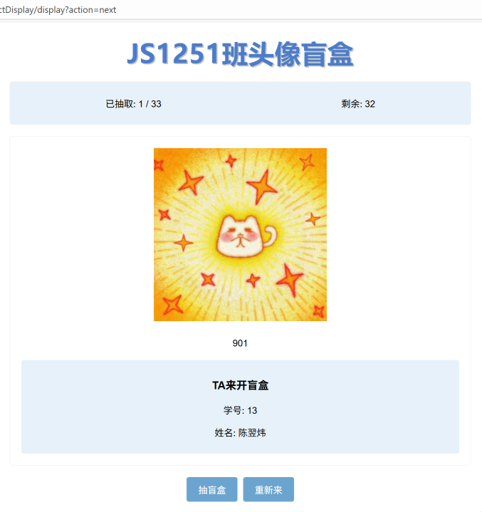

# 新生班级互动系统 · RandomObjectDisplay

一款基于 Java Web 的班级破冰互动工具。通过「头像盲盒」式的随机配对与双轮展示机制，让原本陌生的同学在轻松有趣的氛围中自然相识，快速建立班级凝聚力。

> 本项目为课程设计实践作品，完整保留了开发过程中的设计思路与实现细节。

## 项目背景

大一新生入学伊始，班级成员彼此陌生，传统的自我介绍往往流于形式，难以真正打破隔阂。

我们希望用一款兼具趣味性和互动性的数字破冰工具来改变这一局面：通过**随机配对**和**双轮展示**机制，让同学们在轻松有趣的氛围中自然相识，快速建立班级凝聚力。

### 双轮互动机制

系统通过「双螺旋」式的重复抽取，确保每位同学都经历两轮互动：

**第一轮 · 印象表达**

系统随机展示一位同学的 QQ 头像与昵称，同时随机抽取另一位同学的学号与姓名。被抽到的同学需要对前者的头像昵称说出第一印象，并可选择提出问题。随机配对打破了熟悉的圈子，创造自然的交流契机。

**第二轮 · 自我揭示**

头像昵称的主人站出来「认领」。如果上一轮有问题，需要先回答，然后解释自己头像和昵称的含义，并自由分享其他内容。

## 功能特性

- **随机抽取，绝不重复**：基于 Session 记录每位同学的展示状态，确保同一轮内每位同学至多被展示一次
- **双对象同步展示**：一次抽取同时展示「头像 + 昵称」与「学号 + 姓名」两组信息
- **数据灵活可配**：学生信息保存在 `objects.properties` 配置文件中，无需改代码即可调整班级数据
- **实时进度反馈**：界面清晰展示「已抽取 / 剩余」人数，方便控制活动节奏
- **趣味音效反馈**：每次抽取播放一段简短音效，增强仪式感
- **一键重置**：点击「重新来」即可清空本轮记录，开始新一轮互动

## 技术栈

| 分类 | 技术 |
| --- | --- |
| 语言 | Java 11 |
| Web 框架 | Java Servlet 4.0 + JSP |
| 构建工具 | Maven |
| 前端 | HTML / CSS / JavaScript |
| 数据存储 | properties 配置文件 + Session |
| 运行环境 | Apache Tomcat |

## 系统架构

项目采用经典的 MVC 思路，将展示层、控制层与数据层解耦：

- **视图层（View）**：`index.jsp` 负责页面渲染，结合 CSS 与 JavaScript 提供交互与音效。
- **控制层（Controller）**：`DisplayServlet` 作为唯一入口，接收 `/display` 请求并分发「抽取」「重置」等动作。
- **模型层（Model）**：`ObjectManager` 管理全部学生对象与随机抽取逻辑；`DisplayObject`、`NumberStringObject` 分别承载「头像 + 昵称」与「学号 + 姓名」两组数据。
- **数据层（Data）**：学生信息集中存放在 `objects.properties` 配置文件中，通过 `ObjectManager` 加载，便于按班级实际情况灵活调整。

用户的会话状态通过 `HttpSession` 保存，以此保证抽取过程不重复、进度统计准确。

## 项目结构

```
RandomObjectDisplay/
├── pom.xml                                  # Maven 配置（Servlet 依赖、打包为 WAR）
├── src/main/
│   ├── java/com/example/
│   │   ├── model/
│   │   │   ├── DisplayObject.java           # 头像 + 昵称 数据模型
│   │   │   ├── NumberStringObject.java      # 学号 + 姓名 数据模型
│   │   │   └── ObjectManager.java           # 对象管理、随机抽取、重置
│   │   ├── servlet/
│   │   │   └── DisplayServlet.java          # 控制器，处理 /display 请求
│   │   └── util/
│   │       └── SoundPlayer.java             # 音效播放工具类
│   ├── resources/
│   │   └── objects.properties               # 班级学生数据配置
│   └── webapp/
│       ├── index.jsp                        # 主页面（视图）
│       ├── css/style.css                    # 页面样式
│       ├── js/script.js                     # 前端逻辑与音效
│       ├── images/                          # 头像图片资源
│       ├── sounds/display-sound.mp3         # 抽取音效
│       └── WEB-INF/web.xml                  # Web 应用配置
└── target/                                  # 构建产物（RandomObjectDisplay.war）
```

## 快速开始

### 环境要求

- JDK 11+
- Maven 3.6+
- Apache Tomcat 9 或更高版本

### 构建

```bash
mvn clean package
```

构建产物位于 `target/RandomObjectDisplay.war`。

### 部署

将 `target/RandomObjectDisplay.war` 复制到 Tomcat 的 `webapps/` 目录，启动 Tomcat 后访问：

```
http://localhost:8080/RandomObjectDisplay/
```

## 使用说明

1. 打开首页，点击 **「抽盲盒」** 按钮开始互动
2. 系统随机展示一位同学的**头像与昵称**，同时随机抽取另一位同学的**学号与姓名**
3. 按「印象表达 → 自我揭示」的双轮流程组织现场互动
4. 界面实时显示「已抽取 / 剩余」人数，方便控制节奏
5. 点击 **「重新来」** 重置本轮记录，开始新一轮
6. 每次抽取伴随音效反馈，增强仪式感

## 配置文件

所有班级数据集中在 `src/main/resources/objects.properties`，可按需增删改，无需重新编译核心代码：

```properties
# 对象 i 配置
object.i.image=images/imageX.jpg      # 头像图片路径
object.i.string1=昵称                  # 展示用昵称
object.i.numberString=姓名             # 学号对应姓名
```

## 运行截图



> 系统主界面：顶部为标题，中部为「已抽取 / 剩余」统计栏与展示区域，底部为「抽盲盒」「重新来」两个按钮。
